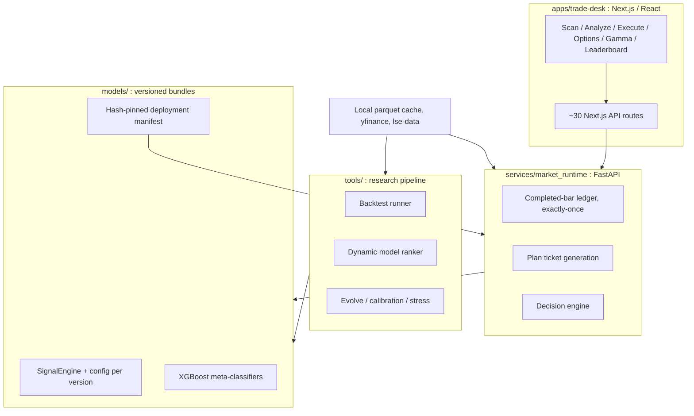
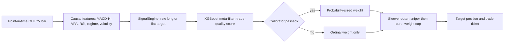
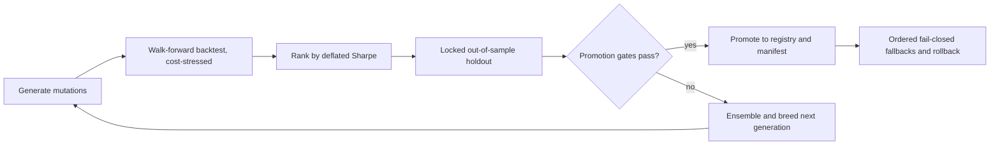
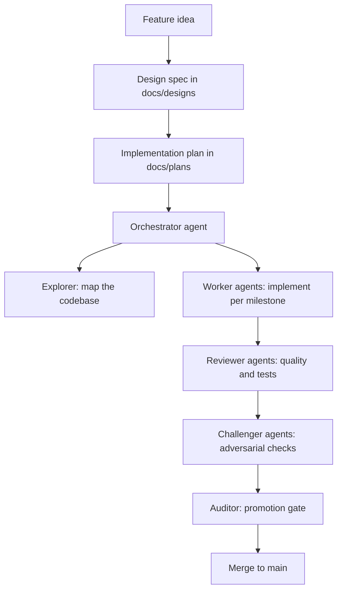

# Algorithmic Trading Research Platform

A full-stack quantitative trading R&D system that **designs, backtests, evolves, calibrates, and deploys** automated equity and options strategies. It pairs a Python signal-engine and backtesting pipeline with a Next.js trade desk and a FastAPI market-runtime service, all governed by a hash-pinned model registry with fail-closed promotion gates. The platform itself was designed and shipped using a multi-agent AI coding workflow (see [How This Was Built](#how-this-was-built)).

> **Disclaimer:** This is a research and educational project. Every performance number here is a **simulated, cost-stressed backtest**, not live trading results, and nothing in this repository is financial advice.

---

## Highlights

- **Versioned signal engines:** 130+ modular, individually versioned `SignalEngine` models (`models/poc_va_macdha/v*`) that emit point-in-time long/flat target positions from OHLCV and engineered features.
- **Cost-aware, causal backtesting:** walk-forward runner with per-trade slippage and commission, out-of-sample lockbox holdouts, and deterministic full-window replay (`tools/`, `services/market_runtime/adaptive_replay.py`).
- **Model evolution engine:** multi-generation genetic mutation and ensemble search that breeds and ranks candidate strategies (`tools/evolve/`, `tools/neuro_evolve.py`).
- **Governed deployment:** a SHA256-pinned deployment manifest with ordered, fail-closed fallbacks and an explicit rollback model (`models/poc_va_macdha/DEPLOYMENT_MANIFEST.json`).
- **Live/runtime stack:** FastAPI service streams completed bars and generates trade tickets with an exactly-once, idempotent bar ledger (`services/market_runtime/`).
- **Trade desk UI:** a dense, institutional Next.js, React 19, TypeScript, and Tailwind dashboard with ~30 API routes for scanning, analysis, execution, options, gamma exposure, and model leaderboards (`apps/trade-desk/`).
- **Anti-overfit discipline:** walk-forward folds, lockbox holdouts, cost-stress tests, Platt probability calibration, deflated Sharpe, and Wilson confidence intervals on win rates before any model is promoted.

## System Architecture



The frontend never talks to a model directly. It calls Next.js API routes, which call the FastAPI runtime, which loads only the models pinned and hash-verified by the deployment manifest. The research pipeline in `tools/` trains and ranks models offline and writes the winner into that manifest.

## How a Model Works

Each model is a self-contained bundle under `models/poc_va_macdha/<version>/`:

```
v72_dual_sleeve/
├── signal_engine.py    # the strategy: features to target position
├── config.json         # universe, interval, costs, engine, strategy params
├── hunt_config.json    # search / gate parameters
├── meta_xgb_final.json # optional XGBoost meta-classifier (trade filter)
└── results.json        # frozen backtest evidence
```

The path a single bar takes to become a position:



**1. Feature layer.** Every model reads a bar plus a causal feature set computed only from data available at or before that bar: MACD histogram, volume and VPA (volume-price analysis) context, RSI, a regime label (trend versus mean-revert), and realized-volatility context. No feature uses future information, so a backtest reproduces exactly what the live runtime would have seen.

**2. Signal engine.** `SignalEngine` maps the feature vector to a discrete target position, long or flat, for the next bar. Engines are pure and deterministic: identical inputs give identical outputs, which is what makes the completed-bar replay ledger and its idempotency guarantees possible.

**3. Meta-classification.** Higher-tier engines do not act on the raw signal directly. They pass candidate entries through an XGBoost meta-classifier (`meta_xgb_final.json`) trained on the realized outcomes of past signals. The classifier estimates the probability that a candidate trade clears its cost hurdle, and low-scoring candidates are dropped. This is how the precision sleeve reaches an 86.5 percent simulated win rate while taking far fewer trades.

**4. Confidence and calibration.** Each engine also emits `last_confidence`. Critically, this is treated as **ordinal** expert support, a ranking signal, not a probability. It is promoted to a calibrated probability only once a cross-fitted Platt calibrator passes validation. Until then the manifest sets `probability_calibrated: false` and `execution_readiness.probability_sized_execution: blocked`, so the system will route and rank but will not size positions as if the confidence were a true win probability. This guard lives in the deployment contract, not just in comments.

**5. Ensembling and routing.** Sleeve and router models compose several frozen experts. `v72_dual_sleeve`, the promoted live book, tries a high-win-rate sniper expert (`v71`) first; if it stands aside, it falls back to a scaled core expert (`v39d`), and both stack under a maximum-weight cap. Before any expert loads, its `signal_engine.py`, config, and dependencies are verified against SHA256 hashes recorded in the manifest, so a live book can never silently run mutated code.

**6. Validation and metrics.** Backtests are causal and cost-aware: each fill pays slippage and commission (5 basis points each in the reference run). Models are scored with walk-forward folds and a locked out-of-sample holdout window that no training touches. Selection uses **deflated Sharpe**, which discounts best-of-many-trials inflation, and win rates are reported with **Wilson 95 percent confidence intervals** rather than bare point estimates. The v85 challenger doc states plainly that its intervals do not support an 80 to 90 percent win-probability claim, and the repository keeps that honesty in writing.

## Evolution & Promotion Pipeline



A candidate only replaces the champion if it clears promotion gates on data it was never trained on. Evidence, integrity hashes, and calibration status are recorded in the manifest so every live model is fully auditable and reproducible.

## Model Registry & Deployment Governance

`models/poc_va_macdha/DEPLOYMENT_MANIFEST.json` is the control plane for what runs live. It:

- **Pins the active bundle and every dependency by SHA256**, so the runtime refuses to load mutated code.
- Declares an **ordered, fail-closed fallback chain** (`v39d_confluence`, then `v71_live_confidence`, then `v39b_live_adapt`) and an explicit **rollback model**.
- Records **promotion evidence** (`STATE.json`, `COMPARE.json`) and **calibration status**, including the `execution_readiness` flag that blocks probability-sized execution until a cross-fitted calibrator passes.
- Carries a **data contract** (source, price adjustment, interval, train and holdout windows, universe, annualization bars per year) so any published result is reproducible bar-for-bar.

## How This Was Built

This platform was designed and shipped using a **multi-agent AI coding workflow** rather than writing every line by hand. Each feature starts as a written design spec (`docs/designs/`) and implementation plan (`docs/plans/`, `docs/superpowers/`), then an orchestrator agent coordinates specialized agents to build and verify it.



The same discipline the models are held to (specify, validate, gate) is applied to the code itself: nothing merges until reviewer and challenger agents have checked it and an auditor clears the gate.

## Representative Backtest Results

7-symbol US equity basket (`TSLA`, `MU`, `SPY`, `IONQ`, `APLD`, `XLP`, `QQQ`), 1-hour bars, `$1,000` starting capital, local adjusted data, 5 bp slippage and 5 bp commission. Simulated only:

| Model | Return | Max Drawdown | Sharpe | Trades | Win Rate |
|-------|--------|--------------|--------|--------|----------|
| `v72_dual_sleeve` (promoted live book) | **+513%** | -19.4% | **3.08** | 179 | 72% |
| `v39d_confluence` (best pure model) | +357% | -13.4% | 2.82 | 135 | 67% |
| `v50_high_win_rate` (precision sleeve) | +109% | -19.5% | 1.87 | 52 | **86.5%** |

Corrected-causal, cost-stressed per-model benchmarks (with Wilson 95 percent confidence intervals on win rate) are generated by the backtest tooling (`tools/`) per model. The system intentionally reports these intervals rather than headline point estimates, and blocks probability-sized execution until a calibrator passes.

## The Trade Desk

The frontend is a dense, institutional terminal: dark desk, steel-teal brand, Source Serif display with IBM Plex body and mono, tabular numerics, and action colors mapped one-to-one to buy / breakout / wait / avoid. It covers scan, analyze, execute, options, gamma exposure, portfolio, and a live model leaderboard across ~30 API routes. The screen-by-screen inventory and full UI spec live in [docs/ui/SCREENS.md](docs/ui/SCREENS.md) and [docs/ui/TRADE_DESK_UI.md](docs/ui/TRADE_DESK_UI.md).

To view it live, run the desk locally: `cd apps/trade-desk && npm run dev`, then open `http://localhost:3000`.

## Tech Stack

- **Backend / ML:** Python 3.13, pandas, NumPy, XGBoost, scikit-learn, FastAPI, uvicorn
- **Data:** local parquet cache, `yfinance`, `lse-data`, with explicit train/holdout data contracts
- **Frontend:** Next.js 15, React 19, TypeScript, Tailwind CSS, framer-motion, three.js
- **Infra:** Docker, virtualenv, file-based experiment tracking, GitHub Actions CI
- **Testing:** pytest (Python) and Sucrase/tsc unit tests (frontend)

## Quick Start

```bash
# Set up Python environment
python -m venv .venv
source .venv/bin/activate
pip install -r requirements.txt

# Run the promoted baseline on the equity basket
.venv/bin/python tools/baseline_manifest.py --cash 1000

# Start the market runtime service
uvicorn services.market_runtime.server:app --reload

# Start the trade desk (in another terminal)
cd apps/trade-desk
npm install
npm run dev
```

## Repo Layout

| Path | Purpose |
|------|---------|
| `models/` | Versioned signal engines, configs, meta-classifiers, deployment manifest |
| `tools/` | Backtesting, evolution, calibration, feedback loops, live planning |
| `apps/trade-desk/` | Next.js / React trading dashboard |
| `services/market_runtime/` | Live data, replay ledger, and ticket-generation service |
| `tests/` | Python and frontend unit and integration tests |
| `docs/` | Research notes and design specs |

## Documentation

| Doc | What's inside |
|-----|---------------|
| [docs/ui/TRADE_DESK_UI.md](docs/ui/TRADE_DESK_UI.md) | Trade desk UI architecture and screen behavior |
| [docs/ui/SCREENS.md](docs/ui/SCREENS.md) | Screen-by-screen inventory of the dashboard |
| [docs/ui/BRAND.md](docs/ui/BRAND.md) | Brand, voice, and visual system |
| [docs/ui/DESIGN_TOKENS.md](docs/ui/DESIGN_TOKENS.md) | Color, type, and spacing tokens |
| [docs/ML_PROD_READINESS_PLAN.md](docs/ML_PROD_READINESS_PLAN.md) | Path from research models to production |
| [docs/confidence_calibration.md](docs/confidence_calibration.md) | Probability calibration approach and gates |
| [docs/designs/](docs/designs/), [docs/plans/](docs/plans/) | Feature design specs and implementation plans |

## Status

Active R&D project. The current promoted live book is `v72_dual_sleeve` (hierarchical sniper plus core sleeve) with `v39d_confluence` as the ordered fallback. New variants are evaluated through walk-forward backtests and fail-closed promotion gates before they can replace the champion. Probability-sized execution stays blocked until a cross-fitted calibrator passes, by design.

---

*Built as a research and portfolio demonstration of full-stack, quantitative, and ML engineering. Not intended for live deployment without independent review and risk controls.*
