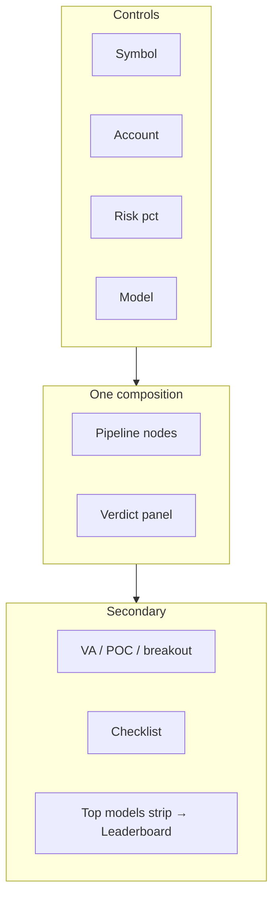
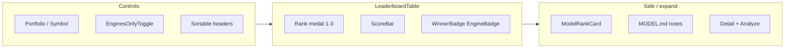

# Trade Desk — Screen Wireframes

Desktop-first dense desk. Tokens: [`DESIGN_TOKENS.md`](./DESIGN_TOKENS.md) · Brand: [`BRAND.md`](./BRAND.md) · Spec: [`TRADE_DESK_UI.md`](./TRADE_DESK_UI.md).

---

## 1. Analyze (`/analyze`) — hero pipeline

**Goal:** See how the model processes data; mirror `_print_analyze`.

### ASCII

```
┌──────────────────────────────────────────────────────────────────────────┐
│ TD  Trade Desk     [Analyze] Watch  Picks  Leaderboard  Models  session ··· │
├──────────────────────────────────────────────────────────────────────────┤
│  Symbol [ TSLA     ]  Account [50000]  Risk [1.0%]  Model [auto ▾] [Run] │
│  ▸ Advanced                                                              │
├──────────────────────────────────┬───────────────────────────────────────┤
│  MODEL PIPELINE                  │  VERDICT                              │
│                                  │  ┌─────────────────────────────────┐ │
│  ┌────┐   ┌────┐   ┌────┐       │  │  TSLA          BUY NOW          │ │
│  │OHLC│──▶│ VA │──▶│HTF │       │  │  ────────────  (green rail)     │ │
│  │pass│   │POC │   │ HA │       │  │  Why: …                         │ │
│  └────┘   │VAL │   │ ✓  │       │  │  Do this: …                     │ │
│           │VAH │   └────┘       │  │  Model v15… (auto: #1 for TSLA) │ │
│           └──┬─┘                │  │  asof 2026-07-11 15:30 ET       │ │
│              ▼                  │  └─────────────────────────────────┘ │
│  ┌────┐   ┌────┐   ┌────┐       │  Confidence ████████░░  78%          │
│  │Rule│──▶│Filt│──▶│Kel │──▶Act │  Hit prob 62%                         │
│  │long│   │VWAP│   │ley │   BUY │                                       │
│  └────┘   │vol │   │0.4 │       │  Entry / Stop / Trail                 │
│           └────┘   └────┘       │  Shares · Notional · $ risk · acct    │
│                                  │                                       │
│  Timing: sector → volume → 22 → 200   (advisory chips)                   │
├──────────────────────────────────┴───────────────────────────────────────┤
│  Value zone  VAL ████████████ VAH     POC |                 Breakout lvl │
│  Checklist gates  ✓ POC  ✓ VA  ✓ HA  ✗ surge  ✓ EMA200  …               │
│  Best models for TSLA   #1 v13_specialists  #2 …   [Leaderboard →] [Use auto] │
└──────────────────────────────────────────────────────────────────────────┘
```

### Mermaid regions



### States

- **Idle:** pipeline nodes muted; verdict empty state.
- **Running:** nodes light left→right; Run disabled.
- **Result:** action rail color; confidence meter animates once.
- **Error:** banner under controls; pipeline last stage fail.

### Mobile

Stack: Controls → Verdict → Pipeline (vertical) → Levels → Gates → Top models strip.

---

## 2. Watch board (`/watch`)

**Goal:** CLI `watch` board — multi-symbol refresh.

```
┌──────────────────────────────────────────────────────────────────────────┐
│ Watchlist [NVDA, MU, ANET        ]  Every [30]s  Interval [1m▾]  [Start] │
│ Model [v15_meta_xgb▾]  Account …  Risk …                                 │
├──────┬────────────────┬────────┬──────┬────────┬─────────┬───────────────┤
│ Sym  │ Action         │ Price  │ Conf │ RVOL   │ EMA22   │ Do next       │
├──────┼────────────────┼────────┼──────┼────────┼─────────┼───────────────┤
│ NVDA │ BUY BREAKOUT   │ 132.40 │ 71%  │ 1.8↑   │ above   │ Wait surge…   │
│ MU   │ PULLBACK ZONE  │ 118.02 │ 64%  │ 0.9    │ near    │ Dip to 22…    │
│ ANET │ WAIT           │ 98.10  │ 55%  │ dry    │ —       │ Re-check…     │
└──────┴────────────────┴────────┴──────┴────────┴─────────┴───────────────┘
│ last tick 14:02:01 · alerts: MU WAIT → PULLBACK ZONE                     │
└──────────────────────────────────────────────────────────────────────────┘
```

- Row left rail = action color; tick flash on refresh.
- Click row → `/analyze?symbol=MU`.
- `watch rotate` mode: toggle “Hot sectors” + `--top`.

---

## 3. Leaderboard (`/leaderboard`)

**Goal:** Full model ranking desk — CLI `rank`, `rank --engines-only`, `rank --symbol IONQ`. Replaces thin Rank page. See also [`LEADERBOARD.md`](./LEADERBOARD.md).

### ASCII

```
┌────────────────────────────────────────────────────────────────────────────────┐
│ TD  Trade Desk     Analyze  Watch  Picks  [Leaderboard]  Models                │
├────────────────────────────────────────────────────────────────────────────────┤
│  Mode: (•) Portfolio overall   ( ) Per-symbol [ IONQ     ] [Rank]              │
│  [ Engines only ✓ ]   Sort: Score ▾   Winner: v20b_macro_light · Default: v15… │
├────┬──────────────────────┬───────┬──────┬──────┬──────┬───────┬───────┬───────┤
│ #  │ Model                │ Score │ WR   │ Sh   │ PF   │ DD    │ Ret   │ Flags │
├────┼──────────────────────┼───────┼──────┼──────┼──────┼───────┼───────┼───────┤
│ ①  │ v15_meta_xgb      ★  │ █▉ 0.81│ 58% │ 1.42 │ 1.60 │ -18%  │ +42%  │ eng  │
│ ②  │ v14_risk_kelly       │ █▊ 0.74│ 55% │ 1.21 │ 1.40 │ -22%  │ +38%  │ eng  │
│ ③  │ v12_regime_router    │ █▋ 0.69│ 61% │ 1.10 │ 1.35 │ -25%  │ +31%  │ eng  │
│ 4  │ v13_specialists      │ █▌ 0.66│ 57% │ 0.95 │ 1.28 │ -20%  │ +29%  │ —    │
│ …  │                      │       │      │      │      │       │       │       │
├────┴──────────────────────┴───────┴──────┴──────┴──────┴───────┴───────┴───────┤
│ ▶ Selected: v15_meta_xgb                                                       │
│   Meta-labeler on v13 side · OOS modest lift · status: active                  │
│   n trades 246 · source results.json · [Open model] [Analyze with this] [auto] │
└────────────────────────────────────────────────────────────────────────────────┘
│ CLI echo: rank [--symbol IONQ] [--engines-only]                                │
└────────────────────────────────────────────────────────────────────────────────┘
```

**Per-symbol mode** adds hist WR column emphasis + `specialist` note when present; empty = “No hist rows for IONQ.US”.

### Mermaid



### States

- Loading: skeleton rows + muted ScoreBars
- Empty portfolio: no cards with portfolio metrics
- Empty symbol: no `per_symbol` hist
- Winner row: brand-soft left rail + `WinnerBadge`
- Default model (may ≠ winner): `DefaultBadge` outline

### Analyze strip (on `/analyze`)

```
│ Top models for TSLA   ① v13_specialists 58%  ② v12…  ③ v8…   [Leaderboard →] │
```

---

## 4. Picks (`/picks`)

**Goal:** `picks` / `rotate` grouped lists.

```
┌──────────────────────────────────────────────────────────────────────────┐
│ Horizon ( day | week )   Model [v14_risk_kelly▾]   Top sectors [5]       │
│ Sectors: [mag7][memory][photonics]…   Symbols override ________  [Scan]  │
├──────────────────────────────────────────────────────────────────────────┤
│ BUY NOW / BUY BREAKOUT                                                   │
│   MU   CLASSIC   $118  conf 72%  risk $500  → buy near 22 / value        │
│ BREAKOUT WATCH                                                           │
│   NVDA …                                                                 │
│ PULLBACK ZONE                                                            │
│   …                                                                      │
│ OTHER HIGH-CONF WAIT                                                     │
│ AVOID                                                                    │
└──────────────────────────────────────────────────────────────────────────┘
```

Sector chips = square radius (not pill clusters). Empty group: one quiet line “None live”.

---

## 5. Model detail (`/models/[id]`)

```
┌──────────────────────────────────────────────────────────────────────────┐
│ ← Leaderboard     v15_meta_xgb                                           │
│ Default engine · Winner may differ (see WINNER.json)                     │
├─ Metrics ───────────────┬─ Routing ──────────────────────────────────────┤
│ WR / Sharpe / PF / DD   │ When auto picks this model · specialists notes │
│ Score (score_metrics)   │ [Analyze with this model]                      │
├─────────────────────────┴────────────────────────────────────────────────┤
│ MODEL.md: hypothesis · status (active / frozen / FAIL OOS)               │
│ Pipeline differences vs v14: shows Meta-XGB stage as active              │
└──────────────────────────────────────────────────────────────────────────┘
```

---

## Cross-screen rules

1. One composition per view — avoid nested card stacks.
2. Tabular nums for all prices/% / scores.
3. Nav verbs: analyze, watch, picks, leaderboard, models.
4. Dense desktop OK; mobile stacks without hiding action/why.
