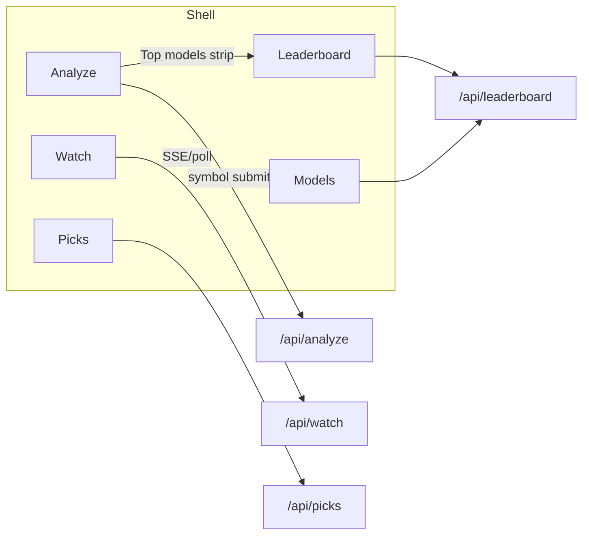
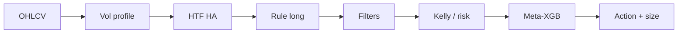

# Trade Desk UI — Full Design Spec

Visual replacement for CLI `tools/trade_desk.py`. Maps 1:1 to CLI commands while making the **model processing pipeline** the Analyze hero.

Related: [`BRAND.md`](./BRAND.md) · [`DESIGN_TOKENS.md`](./DESIGN_TOKENS.md) · [`SCREENS.md`](./SCREENS.md) · [`component-inventory.md`](./component-inventory.md) · [`LEADERBOARD.md`](./LEADERBOARD.md)

---

## 1. Product intent

Institutional **trading model visualization + execution desk** — not a generic fintech dashboard. Users run the same mental model as:

```bash
python3 tools/trade_desk.py TSLA --account 50000 --model auto
python3 tools/trade_desk.py rank --symbol IONQ --engines-only
python3 tools/trade_desk.py picks --horizon day --sectors mag7,memory
python3 tools/trade_desk.py watch NVDA,MU --every 30 --interval 1m
```

Default model in registry: `v15_meta_xgb`. `--model auto` routes via `recommend_model`.

---

## 2. App location (recommendation)

```
apps/trade-desk/          # preferred monorepo app
  package.json            # next, react, lucide-react, tailwind
  app/                    # App Router
  components/
  lib/trade-desk/         # typed clients + mappers
  styles/tokens.css       # from DESIGN_TOKENS.md
```

Alternative: `web/` at repo root if no `apps/` workspace yet. Prefer **`apps/trade-desk`**.

Stack: Next.js 15 App Router · TypeScript · Tailwind (map CSS vars) · Lucide · IBM Plex Sans/Mono + Source Serif 4 (display only).

---

## 3. Information architecture



| Route | CLI analog | Primary job |
|-------|------------|-------------|
| `/` → `/analyze` | `trade_desk.py SYMBOL` | Pipeline + verdict |
| `/watch` | `watch SYM,...` | Live multi-symbol board |
| `/picks` | `picks` / `rotate` | Horizon + sector scan |
| `/leaderboard` | `rank` / `rank --symbol` / `--engines-only` | **Model Leaderboard** (portfolio or per-symbol) |
| `/rank` | redirect → `/leaderboard` | Legacy alias |
| `/models/[id]` | engine card + MODEL.md | Model detail |

Shell: left rail (desktop) or bottom tabs (mobile). Primary nav: **Analyze · Watch · Picks · Leaderboard · Models**. Wordmark: **Trade** + **Desk** (see BRAND.md). No marketing hero.

See [`LEADERBOARD.md`](./LEADERBOARD.md) for full leaderboard UX.

---

## 4. CLI → UI control map

| CLI | UI control | Default | Notes |
|-----|------------|---------|-------|
| `command` / symbol | Symbol input | — | Uppercase; Analyze primary |
| `watch` rest | Comma watchlist | `DEFAULT_WATCH` subset | Watch page |
| `--account` | Number input | `100000` | Equity |
| `--risk-pct` | Number / slider | `0.01` (1%) | Show as % |
| `--model` | Select | `v15_meta_xgb` + `auto` | From `list_engine_models()` |
| `--horizon` | Segmented | `day` \| `week` | Picks / rotate |
| `--sectors` | Multi-select chips | none = all | ROTATION_SECTORS + `beta` |
| `--symbols` | Textarea / tags | — | Picks / Watch |
| `--symbol` | Symbol (Leaderboard) | — | Per-stock `rank_models_for_symbol` |
| `--engines-only` | Toggle | off | Leaderboard: runnable engines only |
| `--period` | Advanced | `60d` | Disclose |
| `--every` | Advanced | `30` (min 15) | Watch refresh s |
| `--interval` | Advanced | `1m` \| `5m`… | Watch bar TF |
| `--top` | Advanced | `5` | Rotate hot sectors |
| `--ticks` | Advanced | `0` | Watch stop |
| `--json` | n/a | always | API always returns JSON |
| `--no-clear` | n/a | — | CLI-only |

**Progressive disclosure:** Basic = symbol, account, risk%, model. Advanced `<details>` = period, every, interval, top, engines-only, raw JSON debug.

**Sectors:** `mag7, memory, photonics, energy, space, quantum, ai_infra, banks, biotech, metals, consumer, crypto, beta`

**Engines (dynamic):** `auto` + dirs under `models/poc_va_macdha/v*` with `signal_engine.py`.

---

## 5. Model processing pipeline (Analyze hero)

Living flow — each node shows pass/fail/neutral + key values. Animate stage activation on Analyze.

```
OHLCV → Volume profile (POC / VAL / VAH) + HTF St.MACD-HA
      → Rule candidate (side = long)
      → Filters (VWAP / vol / red-flag / squeeze)
      → Risk / Kelly sizing (v14+) / optional meta-XGB (v15+)
      → Action + size
```

### Stage → data binding

| Stage | Values shown | Pass criteria (UI) |
|-------|--------------|-------------------|
| 1 OHLCV | `price`, `asof`, `interval`, `atr` | Data present |
| 2 Volume profile | `poc`, `val`, `vah` + VA band viz | Finite POC/VAL/VAH |
| 3 HTF MACD-HA | `htf`, `flags.htf_ha_green` | HA green → pass |
| 4 Rule candidate | `setup_kind`, side=long | Not `structural_break` |
| 5 Filters | flags: VWAP, vol, red-flag, squeeze | Each gate chip |
| 6 Risk / Kelly | `sleeve_fraction`, `confidence`, `hit_probability` | `sleeve > 0` & conf ≥ min |
| 7 Meta-XGB | Shown if model ≥ v15 | Gate on/neutral if N/A |
| 8 Action + size | `plan.action`, `sizing.*` | Terminal node |

**Advisory timing stack** (labels only — not hard gates):

`sector rotation → volume → 22 EMA → 200 EMA`

Show as horizontal micro-rail under pipeline (`near_ema22`, `above_ema22`, `above_ema200`, `vol_surge`, `vol_dry`).



---

## 6. Analyze output layout (from `_print_analyze` / `_plain_plan`)

### Verdict panel (primary)

| Field | Source |
|-------|--------|
| action | `plan.action` |
| why | `plan.why` |
| do_next | `plan.do_next` |
| model | `payload.model` |
| selection reason | `model_selection.reason` |
| asof | `state.asof` |

Actions: `BUY NOW` · `BUY BREAKOUT` · `BREAKOUT WATCH` · `PULLBACK ZONE` · `AVOID (structure broken)` · `AVOID` · `WAIT` · `WAIT (almost ready)`

### Numbers

| UI label | Source |
|----------|--------|
| Price | `state.price` |
| Confidence | `state.confidence` + `plan.confidence_note` |
| Hit probability | `state.hit_probability` |
| Entry / stop / trail_arm | `state.entry`, `stop`, `trail_arm` |
| Risk / share | `state.risk_per_share` |
| Shares / notional | `sizing.shares`, `sizing.notional` |
| Dollar risk / risk% / account | `sizing.dollar_risk`, `risk_pct`, `account` |
| Value zone | `val` → `vah`, `poc` |
| Breakout level | `state.breakout_level` |
| VWAP | `state.vwap` |

### Checklist gates (`plan.checklist`)

Keys from `_FLAG_LABELS`: `poc_hold`, `in_value_area`, `htf_ha_green`, `vwap_uptrend`, `above_vwap`, `vol_confirm_or_pull`, `not_red_flag`, `mom_pos`, `sqz_off_or_release`, `vol_surge`, `vol_awake`, `not_vol_dry`, `above_ema22`, `above_ema200`, `near_ema22`.

### Secondary

- **Top models for {SYMBOL}** — compact strip from `model_ranks_for_symbol` (top 3: rank, model, win_rate, sharpe, score)
- Deep-link: “Full leaderboard →” → `/leaderboard?symbol=TSLA`
- “Use #1” / “Analyze with auto” → re-run with that engine / `--model auto`

---

## 7. Other views (data)

### Watch (`_snapshot_row`)

Per tick: `symbol`, `action`, `why`, `do_next`, `setup_kind`, `price`, `stop`, `rvol`, `vol_surge`, `vol_dry`, `ema22`, `ema200`, `above_ema22`, `above_ema200`, `near_ema22`, `breakout_level`, `confidence`. Highlight action changes (CLI alerts).

### Picks / rotate

Rows grouped like CLI: BUY NOW/BREAKOUT · BREAKOUT WATCH · PULLBACK ZONE · high-conf WAIT · AVOID. Filters: horizon, model, sectors, symbols.

### Leaderboard (primary model ranking surface)

Replaces thin Rank page. Two modes:

| Mode | CLI | API |
|------|-----|-----|
| Portfolio / overall | `rank` [`--engines-only`] | `rank_models(engines_only)` |
| Per-symbol | `rank --symbol IONQ` [`--engines-only`] | `rank_models_for_symbol(sym, …)` |

**Row fields** (from registry): `rank`, `model`, `score` (`score_metrics`), `win_rate`, `sharpe`, `profit_factor`, `max_drawdown`, `total_return`, `trade_count`, `has_engine`, `source`; per-symbol also `code`, `specialist`.

**Badges:** Winner (`WINNER.json.winner`), Default (`DEFAULT_MODEL` = `v15_meta_xgb`), Engine (`has_engine`), status from `MODEL.md` when parsed (frozen / active / satellite / FAIL OOS).

**UI:** medal/# column, sortable metrics, `ScoreBar`, engines-only filter, side panel / row expand → model card → `/models/[id]`.

Artifacts: `WINNER.json`, `TRAINING_LEADERBOARD.json`, per-version `results.json`.

### Model detail

Engine id, MODEL.md hypothesis, default vs auto routing, portfolio metrics, link to Analyze + back to Leaderboard.

---

## 8. Empty / loading / error

| State | Treatment |
|-------|-----------|
| Empty Analyze | Serif title “Analyze a symbol”; symbol field focused; sample `TSLA` ghost |
| Loading | Pipeline nodes `running` left→right; skeleton verdict; no spinner spam |
| Partial (missing bars) | Stage fail + `state.missing` tips |
| Error (yf / engine) | Inline avoid-color banner + retry; keep last good result dimmed |
| Watch empty | Prompt to add symbols or “Load defaults” |
| Picks empty | “None live — check WATCH / PULLBACK” (CLI voice) |
| Rank empty | “No engine cards / findings” |
| Leaderboard empty | “No model cards with portfolio metrics” / “No hist for {SYMBOL}” |

---

## 9. API bridge

Prefer **Next.js Route Handlers** that subprocess the existing CLI with `--json` (zero Python rewrite for v1):

```
POST /api/analyze   → trade_desk.py {SYMBOL} --account --risk-pct --model --period --json
POST /api/watch     → trade_desk.py watch … --every --interval --json  (or poll analyze×N)
POST /api/picks     → trade_desk.py picks --horizon --sectors --symbols --model --json
GET  /api/leaderboard → trade_desk.py rank [--symbol] [--engines-only] --json
GET  /api/rank        → alias → /api/leaderboard
GET  /api/models      → list_engine_models() + DEFAULT_MODEL + WINNER.json winner
GET  /api/models/[id] → version card + MODEL.md excerpt (optional)
```

**Implementation notes:**

- Spawn `.venv/bin/python3 tools/trade_desk.py … --json` from repo root; `cwd` = monorepo root; timeout ~60–120s for scans.
- Parse stdout JSON; stderr → logs; non-zero → 502 with message.
- Watch: HTTP poll every `every` seconds (SSE later); cap symbols (~18 like CLI).
- Later: import Python functions via a thin FastAPI sidecar if subprocess latency hurts.

**Open:** normalize response envelope `{ ok, command, data, asof }` vs raw CLI JSON passthrough.

---

## 10. Layout composition (Analyze)

Desktop — **one composition**, not card collage:

```
┌─ Shell ─────────────────────────────────────────────────────┐
│ Trade Desk          Analyze · Watch · Picks · Leaderboard · Models │
├─ Controls (basic) ──────────────────────────────────────────┤
│ [SYMBOL]  Account ____  Risk % ____  Model [auto ▾]  [Run]  │
│ ▸ Advanced: period · interval …                             │
├─ Pipeline (hero) ──────────────────┬─ Verdict ──────────────┤
│ ○→○→○→○→○→○→○→●  living flow      │ ACTION                 │
│ values on nodes                    │ why / do_next          │
│ timing: rot→vol→22→200             │ conf meter · chance    │
├─ Levels / size ────────────────────┤ entry stop shares …    │
│ VA band · POC · checklist gates    │ model + reason · asof  │
└────────────────────────────────────┴─ Top models for SYMBOL ──┘
```

Cards only for: interactive form groups, watch rows (selectable), leaderboard rows. No card wrappers on pipeline/verdict.

---

## 11. Motion

See DESIGN_TOKENS.md — pipeline activation, confidence meter, watch tick only.

---

## 12. Accessibility

- Color never sole signal (labels + icons)
- Focus rings `--td-focus-ring`
- Table keyboard nav on Watch/Leaderboard
- `aria-live="polite"` on watch action changes

---

## 13. Out of scope (this phase)

Full Next.js implementation, live broker execution, order routing. Design + mapping only.
